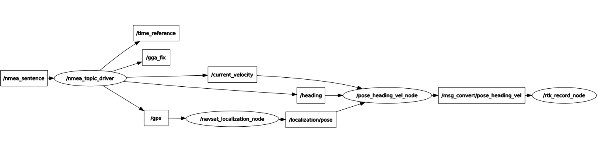

# Autopilot_demo
## 功能：
使用GPS实现循迹功能，目前仍在开发中。

## 环境搭建：
 * 安装ubuntu14.04，这个可以自行按照网上教程下载安装。
 * 安装ros indigo 版本：可以参考：http://wiki.ros.org/cn/indigo/Installation/Ubuntu

## 安装Autopilot_demo：
```
git clone https://github.com/ahuer2435/Autopilot_demo.git
cd cd Autopilot_demo/catkin_ws/
catkin_make
```

## 启动录制轨迹命令：
```
roslaunch nmea_navsat_driver gps_driver.launch
rosrun msg_convert pose_heading_vel_node
rosrun rtk_planning rtk_record_node
```

### 录制路点架构图：


生成轨迹文件： garage.csv。

## 循迹系统：
### 启动循迹系统指令：
```
roslaunch nmea_navsat_driver gps_driver.launch
rosrun msg_convert pose_heading_vel_node
rosrun rtk_planning rtk_replay_planner_node
rosrun msg_convert pose_global_current_node
roslaunch waypoint_follower pure_pursuit.launch
roslaunch twist_controller dbw.launch
```
### 循迹架构图：

