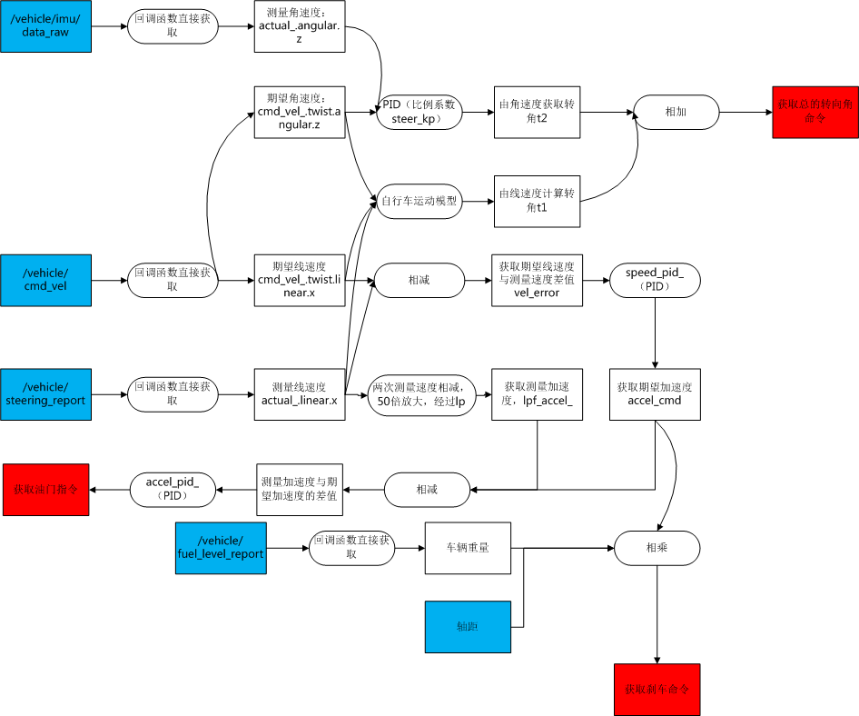

# 运动控制器
## 功能:
将线速度和角速度转化为车辆的刹车,油门和转角指令.
## IO 架构图:

### 输入:
* /vehicle/cmd_vel: 期望速度.
* /vehicle/cmd_vel_with_limits: 带限制的期望速度.
* /vehicle/cmd_vel_stamped:带时间戳的期望速度.(这三个一般用一个).
* /vehicle/fuel_level_report [dbw_mkz_msgs/FuelLevelReport]: 反馈燃料量.
* /vehicle/steering_report: 反馈的转角.
* /vehicle/imu/data_raw: imu反馈数据.

### 输出:
* /vehicle/throttle_cmd [dbw_mkz_msgs/ThrottleCmd]: 油门命令.
* /vehicle/steering_cmd [dbw_mkz_msgs/SteeringCmd]: 转角命令.
* /vehicle/brake_cmd [dbw_mkz_msgs/BrakeCmd]: 刹车命令.
* /vehicle/filtered_accel [std_msgs/Float64]
* /vehicle/req_accel [std_msgs/Float64]

## 算法:

### 计算车辆的实时质量:
### 设置车子实际速度actual_:
* 使用转角反馈信息/vehicle/steering_report 设置实际速度actual_中的线速度x分量.
* 使用imu反馈的信息/vehicle/imu/data_raw 设置实际速度actual_中的角速度z分量
### 更新期望速度cmd_vel_:
* 使用/vehicle/cmd_vel组更新期望速度cmd_vel_.
### 计算期望线速度与时间线速度的偏差vel_error:
* vel_error = 期望线速度cmd_vel_-实际线速度actual_
### 期望线速度小于1m/s, 重启pid的积分.
* 不明白.
### 设置speed_pid_的范围.
* 调用speed_pid_的setRange()函数.
### 获取vel_error的pid输出accel_cmd
* 使用speed_pid_对vel_error进行PID处理,结果存入accel_cmd.
### 设置accel_cmd:
* 如果期望线速度cmd_vel_ 小于 0.01, 设置accel_cmd取accel_cmd与-530 / vehicle_mass / cfg_.wheel_radius的最小值.
### 发布accel_cmd,用于调试.
### 计算油门命令:
* 填写命令类型:CMD_PERCENT,选择百分比.
* 两次采样线速度的差值,乘以系数50,经过lpf_accel_滤波.获得实际加速度lpf_accel_.get().
* 期望加速度accel_cmd与实际加速度lpf_accel_.get(),差值传入accel_pid_,进行PID处理,处理结果即为油门命令.
### 计算刹车命令:
* 填写命令类型: CMD_TORQUE, 选择力矩大小.
* 期望加速度取反*车的质量*轴距.
### 计算转角命令:
* 转角的计算分为两个部分: 线速度的贡献和角速度的贡献.
* 由线速度计算角速度,采用自行车运动学模型,当实际速度speed大于0.5时,使用实际速度计算.否者,若期望速度大于0.1时,使用期望速度计算,否则设置为0.
* 由角速度计算:期望角速度减去实际角速度乘以一个比例系数,相当于一个PID.
* 两者相加即为最后的角度值.
